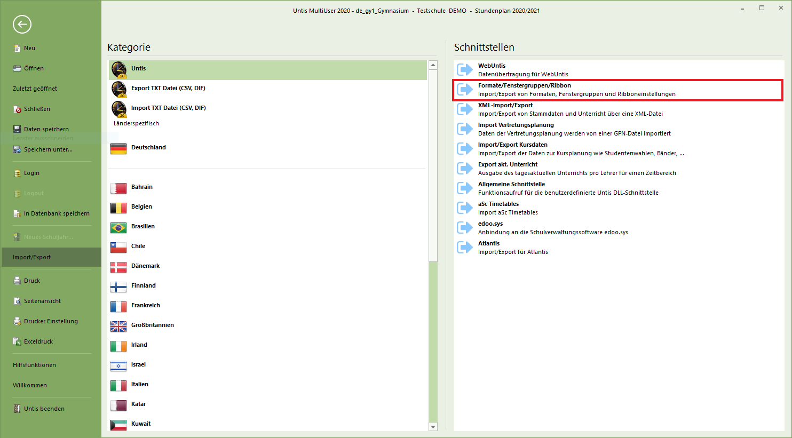
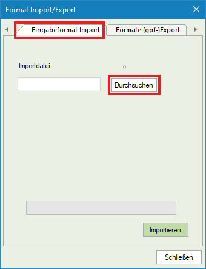
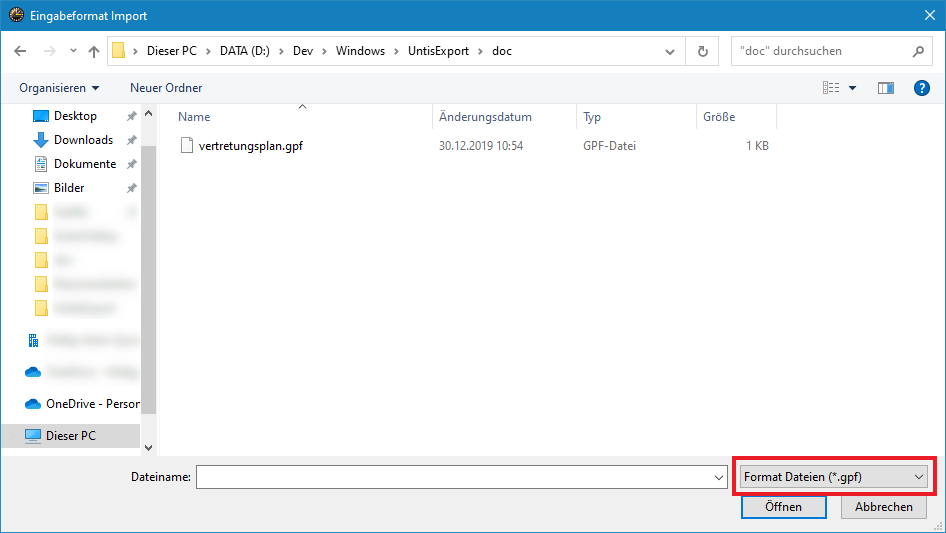
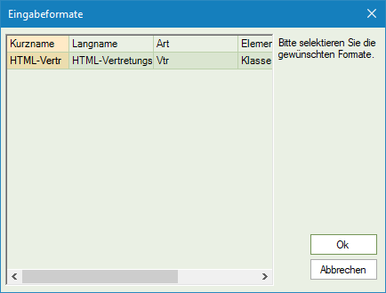
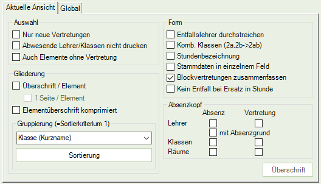
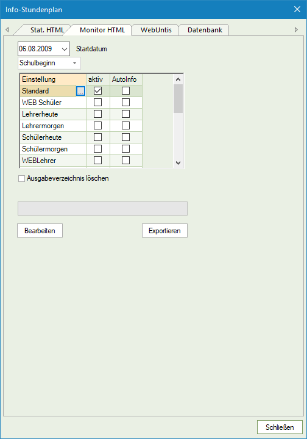
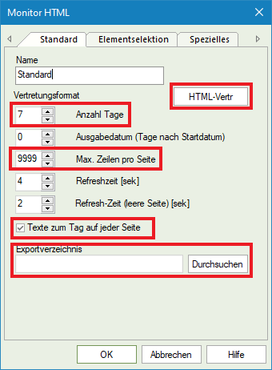

# Einrichtung Untis

## Schritt 1: Export-Format laden

Damit Untis in das richtige HTML-Format exportiert, muss zunächst [folgende Formate-Datei](vertretungsplan.gpf) in Untis geladen werden.

Zunächst im Menü unter "Import/Export" die Kategorie "Untis" auswählen und dort die Schnittstelle "Formate/Fenstergruppen/Ribbon" anklicken.

Es öffnet sich ein Dialog. Dort in den Tab "Eingabeformat Import" wechseln und auf "Durchsuchen" klicken.

Es öffnet sich der "Datei öffnen"-Dialog. Dort in den Ordner wechseln, in dem die Formate-Datei liegt und anschließend die Datei auswählen und auf "Öffnen" klicken.

**Wichtig:** Um die Datei sehen zu können, muss unten rechts das "Format Dateien (*.gpf)" ausgewählt werden.

Abschließend auf "Importieren" klicken. Es öffnet sich nun ein letzter Dialog, welchen man mit "Ok" bestätigen kann.

**Fertig!** Das Vertretungsplan-Format ist nun hinterlegt.

## Schritt 2: Export-Format anpassen (Absenzen)

Aktuell gibt es nicht allzu viele Möglichkeiten, den Export anzupassen. Aktuell ist es nur möglich, Absenzen zu exportieren oder nicht. Dazu in der Druck-Ansicht auf das "Seite einrichten"-Icon klicken.

Im Dialog hat man dann die Möglichkeit, den Absenzkopf anzupassen. Hier kann man die rot markierten Checkboxen aktivieren oder deaktivieren:

## Schritt 3: Untis Info-Stundenplan einrichten

Im Ribbon klickt man oben auf Info-Stundenplan. Es öffnet sich der folgende Dialog:

Dort wählt man die Einstellung "Standard" (alternativ lässt sich auch eine andere nutzen) und klickt auf den Button "..." neben dem Einstellungsnamen.

Im sich öffnenden Dialog müssen nun die folgenden Dinge angepasst werden:

* Das Vertretungsplanformat muss auf "HTML-Vertr" geändert werden. Dies ist das Format, welches in Schritt 1 importiert wurde.
* Die Anzahl der Tage muss auf einen gewünschten Wert geändert werden. Der Wert von 7 spuckt später die Vertretungen der nächsten sieben Tage aus.
* Der Wert "Max. Zeilen pro Seite" muss auf den höchsten Wert von 9999 geändert werden. Anderenfalls werden nicht alle Vertretungen auf eine HTML-Seite geschrieben (die Bibliothek unterstützt dies noch nicht).
* Die Option "Texte zum Tag auf jeder Seite" kann optional aktiviert werden. Dann ist es auch möglich, die Tagestexte zu exportieren. Anderenfalls können diese nicht exportiert werden.
* Das Exportverzeichnis muss auf ein beliebiges Verzeichnis geändert werden.

Anschließend bestätigt man mit "OK.

Im Info-Stundenplan-Dialog abschließend noch das Häckchen "aktiv" setzen. Es empfiehlt sich, das Häckchen "Ausgabeverzeichnis löschen" zu setzen - das ist jedoch kein Muss.

Nun kann man mittels "Exportieren" den HTML-Vertretungsplan erzeugen.